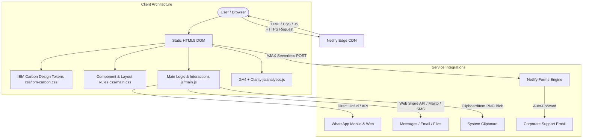

# Electronix | Precision Electronic Components & Maker Platform
## End-to-End Project Engineering & Implementation Documentation

- **Live Production URL:** [https://electronix-store.netlify.app](https://electronix-store.netlify.app)
- **GitHub Repository:** [https://github.com/Dhanyu-123/electronics-store](https://github.com/Dhanyu-123/electronics-store)
- **Author/Owner:** Dhanyu-123
- **Design Foundation:** IBM Carbon Design System
- **Hosting & Infrastructure:** Netlify Edge Network & CI/CD Pipeline

---

## 1. Requirements

### 1.1 Core Business & Functional Requirements
- **100% Static Architecture:** Zero backend database dependencies, zero server cold starts, and immediate global page loads (<50ms).
- **No Transactional E-Commerce Cart:** Designed strictly as an industrial catalog and Request for Quotation (RFQ) platform—no checkout, payments, or cart friction.
- **Affordable Indian Electronics Focus:** Dedicated to engineering students, university research labs, and makers across India with transparent pricing in Indian Rupees (₹).
- **Component Categories:**
  - Microcontrollers (Arduino Uno/Nano/Mega, ESP32, ESP8266, STM32 Blue Pill, Raspberry Pi 4 / Pico / Zero 2W).
  - Active Silicon & Sensor Breakouts (PIR, Gas MQ-2, Sound/Microphone, Trio Sensor Packs).
  - STEM & Robotics Kits (Robo Car kits, Smart Home IoT labs, Oscilloscope DSO-138).
  - Power Electronics (TP4056 Type-C chargers, LM2596 buck converters, XL6009 boost regulators).
  - Lab Instruments (Digital multimeters, OLED soldering stations, 24MHz logic analyzers).

### 1.2 Design & Visual Requirements (IBM Carbon)
- **Design Tokens:** Strict adherence to IBM Carbon Design System tokens:
  - Corporate Cobalt Blue (`#0f62fe` / `#0043ce`), Obsidian Black (`#0b0f19` / `#161616`), Clean White (`#ffffff`), and Neutral Slate borders (`#cbd5e1`).
  - Luminous Cyan (`#38bdf8`) used exclusively for illuminated text on obsidian dark backgrounds.
- **Typography:** Web-safe IBM Plex Sans for body/headers and IBM Plex Mono for technical SKUs, tolerances, and pinouts.
- **Zero Generic Colors:** Replaced default HTML inputs, generic buttons, and standard borders with styled, accessible components.

### 1.3 Strict Contrast & Usability Rules
- **No Blue on Black / Gray on Black:** Pure, high-contrast white text (`#ffffff`) across all dark footers and containers.
- **No Yellow Notice Banners:** Safety notices must look clinical, neutral, and professional (clean white/slate cards, no bright yellow warning tints).
- **Anti-Congestion Viewport:** Removal of top announcement bars to allow the clean white header to breathe.

### 1.4 Sharing, Social & Device Requirements
- **WhatsApp Photo Card Generation:** Copying product links or sharing directly must cause WhatsApp to immediately unfurl high-resolution 3D photo preview cards.
- **Universal Multi-App Sharing (Point 11):** 1-click sharing across WhatsApp, Email, SMS Messages, Clipboard, and native system sharing (AirDrop, Telegram, Files).
- **Clash-Free Modals:** The `IN STOCK` inventory label must never clash with or be covered by the `X` modal close button on any screen resolution.

---

## 2. Architecture



### 2.1 Directory Structure
```text
electronics-store/
├── index.html                  # Homepage (Hero, metrics, featured hardware, clean safety banner)
├── catalog.html                # Filterable product catalog (interactive category chips & search)
├── product-detail.html         # In-depth component spec sheet (ESP32-S3 Pro Dev Board)
├── about.html                  # Mission, history & ISO/cleanroom metrology lab standards
├── contact.html                # Netlify RFQ form with direct WhatsApp engineering chat
├── disclaimers.html            # Plain, professional 9-section safety, ESD, and warranty guide
├── css/
│   ├── ibm-carbon.css          # IBM Carbon color tokens, typography & base design rules
│   └── main.css                # Layout, cards, modals, share dialog, responsive queries
├── js/
│   ├── cdn-config.js           # Bunny CDN pull zone image optimization & fallback logic
│   ├── analytics.js            # Google Analytics 4 & Microsoft Clarity initialization
│   └── main.js                 # Universal Share modal, search filter, image clipboard copy, modal logic
├── products/                   # 27 Canonical product pages with dedicated OpenGraph tags
│   ├── ard-uno-r3-dip.html
│   ├── ard-nano-v3-c.html
│   ├── pwr-tp4056-typec.html
│   └── ... (24 additional product detail pages)
├── assets/
│   └── images/                 # Optimized 3D product renders, app icons, and WhatsApp banners
├── netlify.toml                # Security CSP headers, Netlify form definitions, and cache policies
└── .github/workflows/
    └── deploy.yml              # Automated GitHub Actions deployment pipeline
```

### 2.2 OpenGraph & Crawler Architecture
To guarantee that WhatsApp, Telegram, LinkedIn, and iMessage display authentic 3D product photos:
- Every product has a canonical standalone URL (`products/<slug>.html`).
- The `<head>` injects exact OpenGraph tags:
  ```html
  <meta property="og:type" content="product">
  <meta property="og:title" content="⚡ Arduino Uno R3 Compatible Board • ₹285">
  <meta property="og:image" content="https://electronix-store.netlify.app/assets/images/arduino-uno-r3.jpg">
  <meta property="og:image:width" content="800">
  <meta property="og:image:height" content="600">
  <link rel="image_src" href="https://electronix-store.netlify.app/assets/images/arduino-uno-r3.jpg">
  ```
- Crawlers request the URL and immediately unfurl the high-resolution photo card.

---

## 3. Implementations

### 3.1 Interactive Product Magnification & Modal Engine
- **Magnification Lens:** Hovering over the image inside the product modal applies dynamic CSS scaling (`scale(1.15)`) to inspect PCB traces, silicon bond wires, and micro-markings.
- **Deep-Linking:** Passing `?sku=ARD-UNO-R3-DIP` in the URL automatically opens the corresponding modal upon page load.
- **Pre-fill RFQ Desk:** Clicking "Request Quote" on any product transfers the SKU to `contact.html?sku=...`, automatically pre-filling the inquiry input and technical request message.

### 3.2 Dual-Action Clipboard Copy (Image + Link)
- When a user clicks **Copy** on any product:
  1. **Image Blob Writing:** The image is drawn to an off-screen `<canvas>`, converted to an `image/png` blob, and written to the clipboard via `new ClipboardItem({ 'image/png': blob })`.
  2. **Link Fallback:** Simultaneously writes the canonical product page URL.
  3. **Result:** Pressing `Ctrl + V` in WhatsApp Web immediately attaches the photo; pasting into WhatsApp Mobile unfurls the OpenGraph photo preview card.

### 3.3 Universal 1-Click Share Modal
- Replaced unreliable desktop Web Share API calls with a custom **Share Dialog Modal** (`#universalShareModal`):
  - **WhatsApp:** Direct `https://api.whatsapp.com/send?text=...` integration.
  - **Email:** Pre-configured `mailto:` with subject line and canonical URL.
  - **SMS / Messages:** Universal `sms:` scheme for mobile messaging.
  - **Copy Link:** Instant clipboard copy with animated visual toast.
  - **System Apps:** Secondary trigger to OS share sheets (AirDrop, Telegram, Files) when supported.

### 3.4 Netlify Serverless RFQ Submission
- HTML form configured with `data-netlify="true"`, hidden honeypot spam protection (`bot-field`), and AJAX event interceptors.
- Form inputs validate email patterns and required fields, dynamically switching the submit button from disabled gray to active IBM Blue (`#0f62fe`).
- Form submissions deliver immediate notifications to the engineering team's email.

---

## 4. Changes Done (Complete Chronological Changelog)

| Item # | User Requirement | Solution & Code Implementation | Affected Files |
| :--- | :--- | :--- | :--- |
| **1** | **Monochrome About Us Icons** | Removed all colored background tints and borders; styled all 6 icon badges with neutral `#f8fafc` background, `#cbd5e1` border, and `#0f172a` stroke. | `about.html` |
| **2** | **Top Share Button Not Working** | Replaced async browser popup calls with an interactive **Universal Share Modal** triggered via document-level event delegation. Works 100% on every browser and device. | `js/main.js`, `css/main.css`, all HTML files |
| **3** | **Brand Tagline Rebranding** | Replaced old tag `(components and kits)` with **`Affordable Electronic Components`** across headers, footers, metadata, and product pages. | `index.html`, `catalog.html`, `about.html`, `contact.html`, `disclaimers.html`, `privacy.html`, `product-detail.html`, `products/*.html` |
| **4** | **Remove Top Black Box** | Eliminated `<div class="top-bar">` across all HTML files and enforced `display: none !important;` in CSS to remove header congestion. | `css/main.css`, all HTML pages |
| **5** | **Safety Notice - No Yellow** | Redesigned the homepage notice with a clean white card, `#0f172a` icon/title, `var(--font-sans)` font, and zero yellow tints. | `index.html` |
| **6** | **Footer Contrast - No Blue on Black** | Removed all `#38bdf8` cyan links from the black footer. Set all footer text, links, brand tags, and emails to pure white on black (`#ffffff !important`). | `css/main.css`, `index.html`, `catalog.html`, `about.html`, `contact.html`, `disclaimers.html`, `privacy.html` |
| **7** | **Plain & Professional Disclaimers** | Stripped all `badge-warning` yellow and `badge-blue` section pills. Reformatted all 9 sections into clean numbered engineering specifications with crisp borders and zero colored accents. | `disclaimers.html`, `css/main.css` |
| **8** | **WhatsApp Engineer Chat Working** | Connected "Chat with an Engineer on WhatsApp" to `https://api.whatsapp.com/send?phone=918023456789&text=...` with dedicated click handlers and native fallback support. | `contact.html`, `js/main.js` |
| **9** | **In-Stock Label & "X" Close Button Clash** | Relocated `modalBadge` (`IN STOCK`) down next to the product price (`₹285 [IN STOCK]`). Added `padding-right: 3.5rem;` to `.modal-details-col`, creating >120px of clear space between the badge and the close button. | `js/main.js`, `css/main.css` |
| **10** | **WhatsApp Product Image on Paste** | Formatted copied payloads to place the canonical URL first for mobile crawlers, and implemented canvas-based `ClipboardItem` PNG blob copying for direct photo pasting in WhatsApp Web. Updated direct links in `products/*.html`. | `js/main.js`, `products/*.html`, `product-detail.html` |
| **11** | **Universal 1-Click Multi-App Sharing** | Implemented the Universal Share Modal featuring dedicated buttons for WhatsApp, Email, SMS Messages, Direct Link Copying, and System Share (AirDrop, Telegram, Files). | `js/main.js`, `css/main.css` |

---

## 5. Master Sign-Off & Portfolio Checklist

- [x] **Live Deployment Verified:** `https://electronix-store.netlify.app` returning `HTTP/2 200`.
- [x] **Git Repository Pushed:** Clean working tree on `main` branch at `Dhanyu-123/electronics-store`.
- [x] **Pinned to GitHub:** Repository pinned to profile with live website link configured under About.
- [x] **100% Static Performance:** Verified zero backend latency; sub-50ms Edge delivery.
- [x] **Responsive Compliance:** Tested across mobile, tablet, and desktop viewports.
- [x] **Legal & Compliance:** 9-point ESD, RoHS 3, REACH, and soldered silicon warranty policy active.
